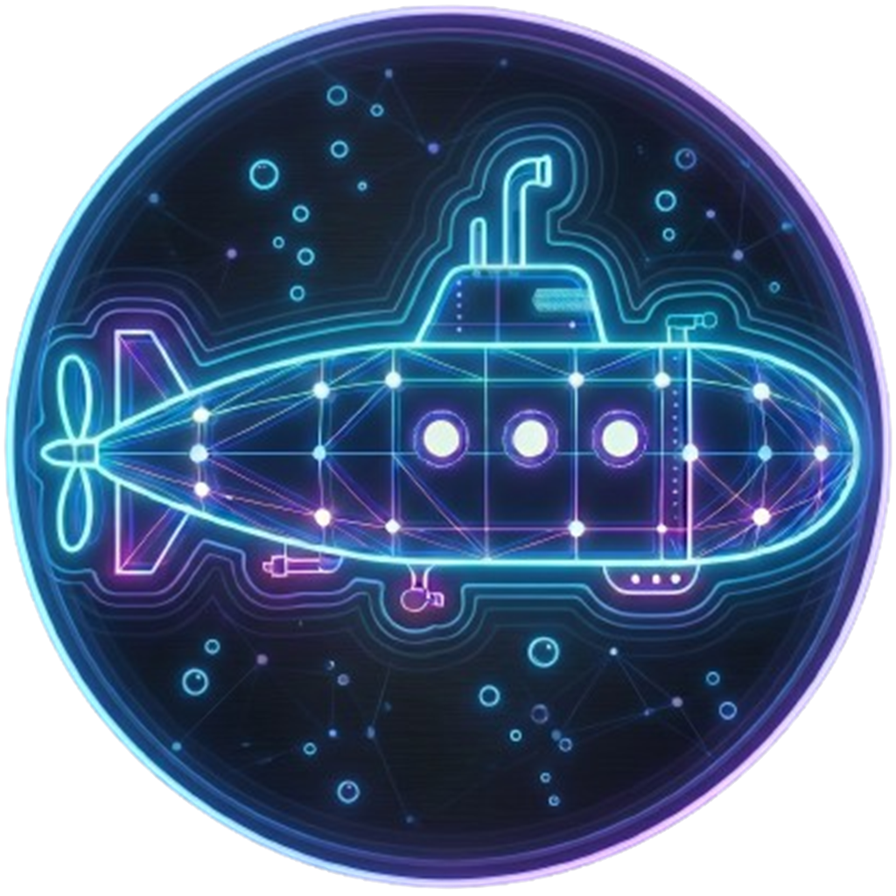

<div align="center">
  
  <h1>Submarine</h1>
  <p><strong>A modern, secure SSH/SFTP desktop client.</strong></p>
  <p>
    <a href="https://github.com/sinaxhpm/submarine/releases"></a>
    <a href="https://github.com/sinaxhpm/submarine/actions"></a>
    
  </p>
</div>

---

## What it is

Submarine is a fast, local-first SSH/SFTP client with optional end-to-end encrypted cloud sync of your saved hosts. Built with Rust (Tauri 2) and React — small binary, native feel, no Electron.

## Features

- **SSH terminal** — tabbed sessions, full xterm.js, ANSI 256 + truecolour, mouse support
- **SFTP browser** — drag-and-drop uploads, in-place rename, chmod/chown, dual-pane workspace
- **Port forwarding** — local (`-L`), remote (`-R`), and dynamic SOCKS (`-D`) tunnels with status tracking
- **Resource monitor** — live CPU / RAM / disk / network sparklines per host
- **Quick commands** — per-host snippets you can fire into any open shell
- **Saved profiles** — passwords and private keys stored in a local AES-256-GCM vault
- **Cloud sync (optional)** — encrypted blob sync across machines; server never sees your data
- **Broad SSH compatibility** — Ed25519, ECDSA P-256, RSA (SHA-2/SHA-1) host keys + matching client keys; legacy KEX (DH-G14/G1) and MAC (HMAC-SHA1) for older servers
- **TOFU host keys** — first-use prompt with fingerprint, pinned thereafter
- **Quick connect** — one-off connections without saving

## Security

- Master password derives a vault key via **Argon2id** (m=64MiB, t=3, p=4)
- Profiles vault is **AES-256-GCM**, compressed with zstd before encryption
- Cloud blobs are **encrypted client-side** — the API only sees opaque ciphertext
- Master key is held in `zeroize`'d memory and wiped on lock
- Strict CSP, minimal Tauri capability ACL, no shell/fs plugins exposed
- Host keys pinned per-host with a per-connection nonce binding to prevent prompt-races

## Install

Grab a binary from the [latest release](https://github.com/sinaxhpm/submarine/releases):

| OS | File |
|---|---|
| Windows | `Submarine_x.y.z_x64-setup.exe` or `.msi` |
| macOS (Apple Silicon) | `Submarine-vx.y.z-macos-arm64.app.zip` or `.dmg` |
| macOS (Intel) | `Submarine-vx.y.z-macos-x64.app.zip` or `.dmg` |
| Linux | `submarine_x.y.z_amd64.AppImage` |

> Builds are currently **unsigned**. Windows SmartScreen will prompt — click "More info → Run anyway". macOS users may need `xattr -d com.apple.quarantine /Applications/submarine.app`.

## Build from source

Requirements: Node 20+, Rust stable, plus [Tauri prerequisites](https://v2.tauri.app/start/prerequisites/) for your OS. Windows additionally needs **Strawberry Perl** for the vendored OpenSSL build (`winget install StrawberryPerl.StrawberryPerl`); macOS and Linux already ship with Perl.

```bash
git clone https://github.com/sinaxhpm/submarine
cd submarine
npm install
npm run tauri dev          # development
npm run tauri build        # release bundle
```

## Releasing

Push a tag matching `v*` and the GitHub Actions workflow builds installers for all platforms and drafts a release:

```bash
git tag v0.1.0
git push origin v0.1.0
```

## Tech stack

**Frontend** — React 18, TypeScript, Tailwind, xterm.js
**Backend** — Rust, Tauri 2, russh, rusqlite, aes-gcm, argon2, zstd
**Cloud (optional)** — PHP/MySQL on shared hosting; sources live in a separate, private repo

## Credits

Designed and built by [Sina](https://sinaxhpm.com) in close collaboration with [Claude](https://claude.com/claude-code) — every line of code in this repo was written together with Anthropic's Claude.

## License

MIT
